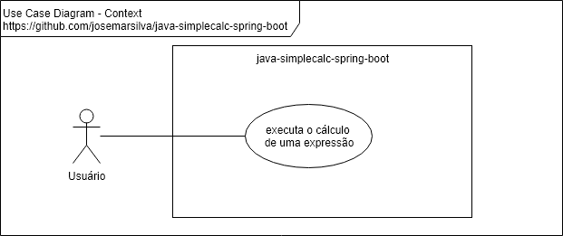
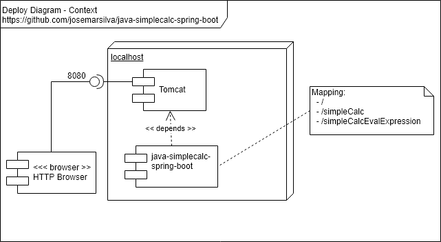
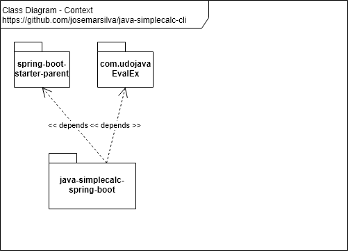

# README - java-simplecalc-spring-boot
Java Simple Calculator - Command Line

## 1. Introduction

This is repository of the project **java-simplecalc-spring-boot**.

## 2. Documentation

### 2.1. Use Case Diagram

 


### 2.2. Deploy Diagram

 


### 2.3. Packages and Class Class Diagram

 

### 2.4. Branch Strategy Workflow

Branch:
* `master`: pronto para produção
* `develop`: último desenvolvimento pronto para produção

Consulte todos detalhes da [estratégia de branches e workflow](https://github.com/josemarsilva/eval-git#38-estrat%C3%A9gia-de-gerenciamento-de-branches) deste projeto.


## 3. Project

### 3.1. Preconditions

* Java JDK 1.8 (jar file includes runnable)
* Espring-bootpse (version Neon recommended)
* Apache Maven 3.6 (recommended > 3.3)
* Spring Boot `pom.xml` configuration:
  1. Spring Boot Starter Parent
  2. Spring Boot Starter Web
  3. Java Version 8
  4. Spring Boot Plugin
  5. Create Spring Boot Application Loader


### 3.2. Guide for Developers

* Clone source code using "git clone". Use branch "master" if branch "develop" is not available.
* Read, if avaliable, "2. Documentation"  and "3.X. Guides, Patterns, Standard, Conventions and Best Practices" to understand patterns, standards, conventions and best practices used in this project.
* Make your changes, commit and push on "develop" branch. Use branch "master" if branch "develop" is not available. Ask me permission, if not available permission to push.


### 3.3. Guide for Configuration

* n/a


### 3.4. Guide for Test

The following command line runs JUnit tests.

```bat
```


### 3.5. Guide for Deploy

The following command line builds a runnable (.jar) in `.\target\java-simplecalc-spring-boot-jar-with-dependencies.jar`

```bat
C:\..\java-simplecalc-spring-boot> mvn clean compile package assembly:single
```


### 3.6. Guide for Demonstration

* n/a


### 3.7. Patterns, Standard, Conventions and Best Practices

* n/a


## I - References

* [spring-boot-starter-parent correct version](https://stackoverflow.com/questions/41032446/springbootapplication-cannot-be-resolved-to-a-type)
* https://help.espring-bootpse.org/neon/index.jsp?topic=%2Forg.espring-bootpse.stardust.docs.wst%2Fhtml%2Fwst-integration%2Fconfiguration.html